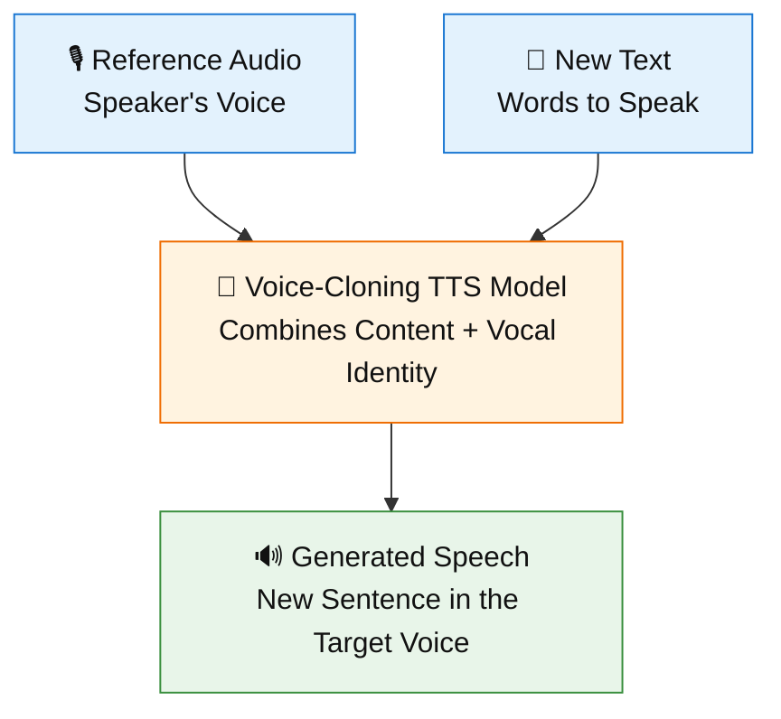

# Voice Cloning
Voice cloning is a form of speech synthesis that generates new speech resembling a specific person's voice.

```mermaid
flowchart TD
    A["🎙️ Reference Audio<br/>Speaker's Voice"]
    B["📝 New Text<br/>Words to Speak"]
    C["🧠 Voice-Cloning TTS Model<br/>Combines Content + Vocal Identity"]
    D["🔊 Generated Speech<br/>New Sentence in the Target Voice"]

    A --> C
    B --> C
    C --> D

    style A fill:#E3F2FD,stroke:#1976D2,color:#111
    style B fill:#E3F2FD,stroke:#1976D2,color:#111
    style C fill:#FFF3E0,stroke:#EF6C00,color:#111
    style D fill:#E8F5E9,stroke:#388E3C,color:#111
```
